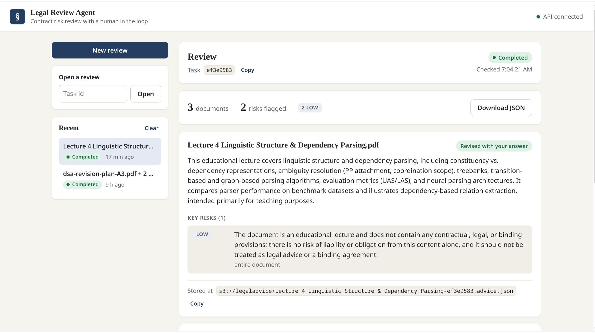
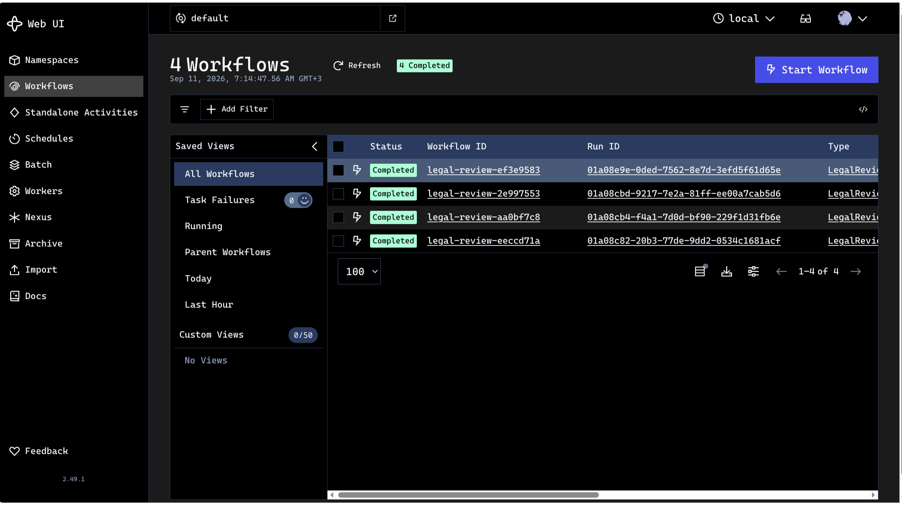
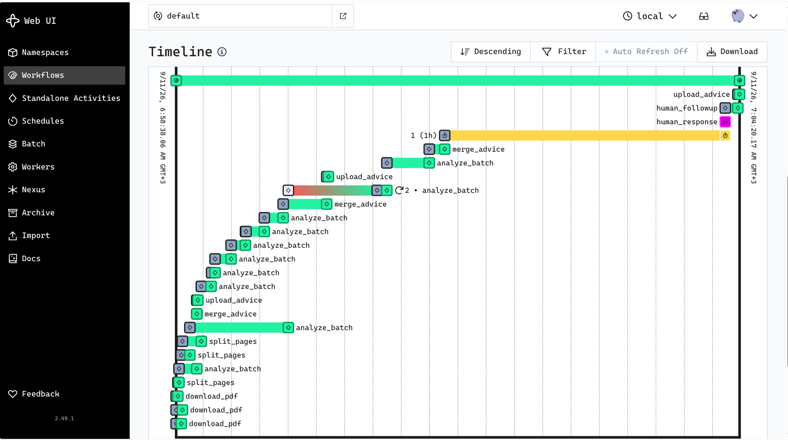

# Legal Review Agent

A FastAPI service with two Temporal pipelines over S3-compatible object storage:

- **Legal review** (`POST /legal`): upload several PDFs and a language model
  reviews each one for legal risk: a summary, the key risks with a severity and
  a location, and a pause for a human whenever the model needs a fact only the
  client knows. Each document's advice is stored as JSON and can be read as
  soon as that document finishes.
- **PDF to Markdown** (`POST /process`): upload a PDF and the service stores the
  original, parses it with
  [pymupdf4llm](https://pymupdf.readthedocs.io/en/latest/pymupdf4llm/), stores
  the resulting Markdown, and pulls that Markdown back onto local disk for
  inspection.

Each pipeline is a Temporal workflow on its own task queue, served by its own
worker, and a browser UI served by the API drives the legal review.

## Contents

- [Screenshots](#screenshots)
- [How it works](#how-it-works)
  - [PDF to Markdown](#pdf-to-markdown)
  - [Legal review](#legal-review)
- [Layout](#layout)
- [Requirements](#requirements)
- [Setup](#setup)
  - [Environment variables](#environment-variables)
- [Running](#running)
  - [Locally](#locally)
  - [With the workers in Docker](#with-the-workers-in-docker)
  - [Ports](#ports)
  - [Browser UI](#browser-ui)
- [API](#api)
  - [`GET /health`](#get-health)
  - [`POST /process`](#post-process)
  - [`GET /process/{task_id}`](#get-processtask_id)
  - [`POST /legal`](#post-legal)
  - [`GET /legal/{task_id}`](#get-legaltask_id)
  - [`POST /legal/{task_id}/respond`](#post-legaltask_idrespond)
  - [Errors](#errors)
  - [Task ids](#task-ids)
- [Tests](#tests)
- [Code quality](#code-quality)
- [Exceptions](#exceptions)
- [Temporal activities](#temporal-activities)
  - [Logging](#logging)
  - [The workflow](#the-workflow)
  - [One directory per worker](#one-directory-per-worker)
  - [Running a worker in Docker](#running-a-worker-in-docker)
  - [Persistent scratch space](#persistent-scratch-space)
- [License](#license)

## Screenshots

The browser UI with a finished review: the totals and risks by severity, then
one card per document with its review decision, summary, key risks and where
the advice was stored.



Finished reviews in the Temporal web UI, one `legal-review-<task_id>` workflow
per review:



The timeline of one review: three documents downloaded and split side by side,
an `analyze_batch` call per page batch (one of them retried), a `merge_advice`
per document, and then one document waiting on a human, the one-hour timer,
until the `human_response` signal arrives and `human_followup` revises its
advice before `upload_advice` stores it.



## How it works

### PDF to Markdown

`POST /process` stores the upload, then hands the work to Temporal:

1. The route writes the PDF into `TEMP_PDF_FOLDER` and uploads it to
   `S3_PDF_BUCKET`, then starts `ProcessPdfWorkflow` with just the two keys
2. `download_pdf` pulls the PDF onto whichever worker picked up the task
3. `parse_pdf` converts it to Markdown with pymupdf4llm
4. `upload_md` writes the Markdown to `S3_PARSED_MDS`
5. `download_md` pulls it back into `TEMP_MD_FOLDER`

The document itself never travels through the workflow history: the route
uploads it first and the workflow passes only keys, which is also why the
worker does not need to share a filesystem with the API.

Each run gets a short random id, so `report.pdf` uploaded twice becomes
`report-a1b2c3d4.pdf` and `report-9f8e7d6c.pdf` rather than overwriting itself.
Both the PDF and its Markdown share the same run id, and the workflow id is
derived from the PDF key so a retried upload deduplicates.

Retry behaviour comes from named policies in `enums/RetryPolicy/` rather than
being spelled out at each call site: `StorageRetryPolicy()` retries three times
with a one-second initial backoff, `ParsingRetryPolicy()` twice with a
five-second one, and `StrictRetryPolicy()` does not retry at all. Storage steps
time out after a minute, parsing after ten.

### Legal review

`POST /legal` accepts up to `LEGAL_MAX_PDFS` documents in one request, stores
each in `S3_PDF_BUCKET` under its own key, and starts one `LegalReviewWorkflow`
(`legal-review-<task_id>`) on `LEGAL_TASK_QUEUE`. For every document it runs:

1. `download_pdf` pulls the PDF onto the worker (the same activity the other
   pipeline uses)
2. `split_pages` parses it page by page and groups the pages into batches of
   `LEGAL_PAGES_PER_BATCH`
3. `analyze_batch` sends the batches to the model one at a time and validates
   each reply into a summary and a list of key risks
4. `merge_advice` consolidates the batches into one review; a document that fit
   in a single batch skips this call
5. if the model asked a question, the document waits for
   `POST /legal/{task_id}/respond`, and `human_followup` revises the advice
   with the answer
6. `upload_advice` writes the advice JSON to `S3_LEGAL_ADVICE` as
   `<pdf key without .pdf>.advice.json`

**Concurrency.** At most `LEGAL_MAX_CONCURRENT_PDFS` documents (default 10) are
in flight at once. The limit is a semaphore inside the workflow rather than a
worker setting, so it holds however many worker processes are running. A
document waiting on a human is not in flight: it gives its slot back for the
wait and takes one again only to revise its advice, so open questions cannot
stall the rest of the review. On the worker, the blocking steps (the S3
download and upload, and parsing) run in threads, so one document's I/O does
not hold up the model calls of the others. PyMuPDF is not thread-safe, so
parsing goes through a lock and runs one document at a time.

**Human in the loop.** The model decides when it needs a human: it sets
`needs_human` and asks one question. The review then reports `awaiting_human`
and lists the question under `pending_questions`. If nobody answers within
`HUMAN_INPUT_TIMEOUT_SECONDS` (an hour by default), the document finishes
anyway with the draft advice, marked `unreviewed_timeout` and
`needs_attention`, so the work already done is not thrown away. Advice revised
with an answer is `human_approved`; advice that never needed a human is
`auto_approved`.

**Results as they finish.** The workflow publishes each document's advice the
moment it is stored, so `GET /legal/{task_id}` returns finished documents under
`results` while the rest of the review is still running.

**Batching and the model.** Each batch of up to `LEGAL_PAGES_PER_BATCH` pages
(default 30) is one model call, plus one merge call per document with more
than one batch. A reply may be up to `LLM_MAX_TOKENS` long (default 16000),
which leaves room for the merged review of a large document with many risks,
and a call may take up to `LLM_TIMEOUT_SECONDS` (default 300).

A reply cut off at the token limit is an error, not something to salvage:
repairing it would silently drop every risk the model had not written yet.
Raise `LLM_MAX_TOKENS` or lower `LEGAL_PAGES_PER_BATCH` if it happens. A reply
that is complete but malformed (wrapped in a code fence or prose, a trailing
comma, unquoted keys) is repaired with
[json-repair](https://github.com/mangiucugna/json_repair) and the repair is
logged; one that still is not a JSON object is rejected. Every reply is then
validated before it is trusted: an unknown severity, a missing summary, or
`needs_human` without a question fails the activity, and `LLMRetryPolicy()`
gives model calls three attempts, backing off from ten seconds.

The model is whatever `OPENROUTER_MODEL` names. The client asks for JSON output
and validates the reply either way, so choose a model that follows JSON
instructions reliably. Activities ask `interfaces.get_llm()` for the model and
never import a vendor client, so another provider is one more `LLMInterface`
implementation registered in `interfaces/llm_factory.py`.

## Layout

```
main.py                      FastAPI app, /health, the UI mount, uvicorn entrypoint
worker.py                    PDF worker entrypoint (uv run worker.py)
workers/process_pdf_worker/  the PDF -> Markdown worker, with Docker/
workers/legal_advice_worker/ the legal review worker, with Docker/
utils/create_worker.py       create_worker() factory
routes/process.py            POST /process, GET /process/{task_id}
routes/legal.py              POST /legal, GET /legal/{task_id},
                             POST /legal/{task_id}/respond
workflows/                   ProcessPdfWorkflow, LegalReviewWorkflow
activities/                  one Temporal activity per file
schemas/                     one dataclass schema file per activity/workflow
interfaces/                  LLMInterface, the OpenRouter client, get_llm()
prompts/                     one prompt per file: legal advice, merge, follow-up
enums/RetryPolicy/           one retry policy per file
enums/                       TaskStatus, RiskSeverity, ReviewDecision, ...
utils/utility.py             get_s3_client, upload_s3_file, download_s3_file,
                             build_run_artifacts
utils/temporal_client.py     get_temporal_client
utils/config.py              pydantic-settings Settings, loaded from .env
utils/logger.py              setup_logging, get_logger
utils/store_upload.py        validate_upload, store_upload, store_uploads
utils/responses.py           the JSON bodies the /process endpoints return
utils/legal_responses.py     the JSON bodies the /legal endpoints return
utils/batching.py            split_pages_into_batches
utils/http_errors.py         exception -> HTTP status mapping
utils/workflow_ids.py        task id <-> workflow id
parsers/pymupdf_parser.py    parse_pdf, parse_pdf_pages, parse_pdf_to_file
exceptions/                  the project's exception hierarchy
ui/                          the browser UI: index.html, styles.css, app.js
images/                      screenshots used in this README
tests/                       pytest suite (offline, no credentials needed)
assets/                      local scratch space (gitignored)
setup/                       Temporal server samples (see below)
```

## Requirements

- Python 3.12+
- [uv](https://docs.astral.sh/uv/)
- A Temporal server: the [Temporal CLI](https://docs.temporal.io/cli)
  (`temporal server start-dev`) or Temporal's Docker Compose stack
- Three S3-compatible buckets, for PDFs, Markdown and legal advice (this
  project is developed against [IDrive e2](https://www.idrive.com/e2/), but
  plain AWS S3 works too)
- An [OpenRouter](https://openrouter.ai/) API key with credits, for the legal
  review
- Docker, to run the workers as containers

## Setup

```bash
git clone https://github.com/omarTBakr/legal-review-agent.git
cd legal-review-agent
uv sync
```

Copy the example environment file and fill in your credentials:

```bash
cp .env.example .env
```

`.env` is gitignored — keep your real keys out of version control.

### Environment variables

| Variable | Description |
| --- | --- |
| `AWS_ACCESS_KEY_ID` | Access key for the object store |
| `AWS_SECRET_ACCESS_KEY` | Secret key for the object store |
| `AWS_REGION` | Region code, e.g. `us-west-4` |
| `AWS_ENDPOINT_URL` | S3 endpoint, e.g. `https://s3.us-west-4.idrivee2.com` |
| `S3_PDF_BUCKET` | Bucket the uploaded PDFs land in |
| `S3_PARSED_MDS` | Bucket the parsed Markdown lands in |
| `TEMP_PD_DIR` | Local scratch root, relative to the project root |
| `TEMP_PDF_FOLDER` | Sub-folder of `TEMP_PD_DIR` holding PDFs |
| `TEMP_MD_FOLDER` | Sub-folder of `TEMP_PD_DIR` holding Markdown |
| `API_HOST` | Host uvicorn binds to (default `0.0.0.0`) |
| `API_PORT` | Port uvicorn listens on (default `8000`) |
| `TEMPORAL_HOST` | `host:port` of the Temporal frontend (default `localhost:7233`) |
| `TEMPORAL_NAMESPACE` | Temporal namespace (default `default`) |
| `TEMPORAL_TASK_QUEUE` | Task queue for the workflow and activities (default `process_pdf_queue`) |
| `LOG_LEVEL` | Root log level (default `INFO`) |
| `RUN_WORKER_IN_API` | Run the PDF worker inside the API process (default `false`) |
| `OPENROUTER_API_KEY` | OpenRouter API key, needed by the legal review worker |
| `OPENROUTER_MODEL` | OpenRouter model id the legal review uses |
| `OPENROUTER_BASE_URL` | OpenRouter API base URL (default `https://openrouter.ai/api/v1`) |
| `LLM_PROVIDER` | Which `LLMInterface` implementation `get_llm()` returns (default `openrouter`) |
| `LLM_MAX_TOKENS` | Longest reply the model may write (default `16000`) |
| `LLM_TIMEOUT_SECONDS` | Timeout for one model call (default `300`) |
| `LLM_TEMPERATURE` | Sampling temperature (default `0.2`) |
| `S3_LEGAL_ADVICE` | Bucket the advice JSON lands in (default `legaladvice`) |
| `LEGAL_TASK_QUEUE` | Task queue for the legal review (default `legal_advice_queue`) |
| `LEGAL_MAX_CONCURRENT_PDFS` | Documents in flight at once within one review (default `10`) |
| `LEGAL_PAGES_PER_BATCH` | Pages per model call (default `30`) |
| `LEGAL_MAX_PDFS` | Most documents accepted in one request (default `20`) |
| `HUMAN_INPUT_TIMEOUT_SECONDS` | How long a document waits for an answer before finishing unreviewed (default `3600`) |

All three buckets must already exist; the service does not create them.

`LEGAL_PAGES_PER_BATCH`, `LEGAL_MAX_CONCURRENT_PDFS` and
`HUMAN_INPUT_TIMEOUT_SECONDS` are read by the API when a review is submitted and
travel with the workflow: changing them needs an API restart but no new worker,
and reviews already running keep the values they started with. The `LLM_*` and
`OPENROUTER_*` values are read by the legal worker, so restart it after
changing them.

## Running

The API, the PDF worker and the legal review worker are separate processes,
all pointed at the same Temporal server.

### Locally

```bash
temporal server start-dev                       # 1. Temporal
uv run worker.py                                # 2. PDF worker
uv run python -m workers.legal_advice_worker    # 3. legal review worker
uv run main.py                                  # 4. API and browser UI
```

For the PDF pipeline alone, `RUN_WORKER_IN_API=true` has the API host the PDF
worker, so Temporal and `uv run main.py` are enough. That setting covers only
the PDF worker; the legal review always needs its own. In production leave
`RUN_WORKER_IN_API` off, so a slow parse cannot starve request handling and
in-flight work survives an API restart.

Startup fails loudly if `RUN_WORKER_IN_API` is set and Temporal cannot be
reached: an API that was asked to host a worker but has none would accept
uploads that nothing ever picks up.

### With the workers in Docker

Each worker has a compose file that joins the external `temporal-network`, the
network a Docker Compose Temporal stack runs on, and reaches Temporal there as
`temporal:7233`:

```bash
docker compose -f workers/process_pdf_worker/Docker/docker-compose.yml up -d --build
docker compose -f workers/legal_advice_worker/Docker/docker-compose.yml up -d --build
RUN_WORKER_IN_API=false uv run main.py
```

Keep `RUN_WORKER_IN_API=false` for the API while the PDF worker runs in a
container, or two workers poll the same queue. More under
[Running a worker in Docker](#running-a-worker-in-docker).

### Ports

| Port | What |
| --- | --- |
| `8000` | The API (`API_PORT`): the endpoints below, interactive docs at `/docs`, the browser UI at `/` and `/ui` |
| `7233` | The Temporal frontend (`TEMPORAL_HOST`), which the API and the workers connect to |
| `8233` | The Temporal web UI, with `temporal server start-dev` |
| `8080` | The Temporal web UI, in Temporal's Docker Compose stack |

The workers serve no HTTP and need no port.

`POST /process` and `POST /legal` return 503 if Temporal is unreachable. If the
server is up but no worker is polling the queue, the upload is still accepted
with a 202 and the task simply stays `processing` until a worker appears.

### Browser UI

`http://127.0.0.1:8000/` opens a UI for the legal review pipeline (see
[Screenshots](#screenshots)). It lives in `ui/` as plain HTML, CSS and
JavaScript with no build step, and the API serves it at `/ui`. Upload several
PDFs, watch each document's progress, answer the model's questions as they
come up, and read each document's results as soon as it finishes, without
waiting for the rest: a summary, its key risks worst first, and whether a human
answered its question. When the whole review is done it adds the totals by
severity and a JSON download. Recent reviews are remembered in the browser,
and any review can be reopened by its task id or its `legal-review-<task_id>`
workflow id.

The UI is a client of `/legal` like any other, so the legal review worker has to
be running too.

To test it with other people on your network, start the API with
`API_HOST=0.0.0.0` and share `http://<your-ip>:8000/`. There is no login:
anyone who can reach the port can upload documents and spend model credits.

## API

### `GET /health`

```json
{ "status": "ok" }
```

### `POST /process`

Accepts `multipart/form-data` with a single field named `file` containing a
`.pdf`. Stores the PDF, starts the workflow and returns **202 straight away** —
it does not wait for the pipeline to finish.

```bash
curl -F "file=@report.pdf" http://127.0.0.1:8000/process
```

```json
{
  "status": "processing",
  "task_id": "a1b2c3d4",
  "workflow_id": "process-pdf-a1b2c3d4",
  "pdf_bucket": "temporalpdfs",
  "pdf_key": "report-a1b2c3d4.pdf",
  "md_key": "report-a1b2c3d4.md"
}
```

Add `?wait=true` to hold the request open until the pipeline finishes and get
the full result in one call (HTTP 200). Convenient for small documents; a large
PDF will outlast most proxy timeouts.

### `GET /process/{task_id}`

Reports where a task got to. Temporal holds the state, so nothing is stored
here.

```json
{ "status": "processing", "task_id": "a1b2c3d4", "workflow_id": "process-pdf-a1b2c3d4" }
```

Once finished:

```json
{
  "status": "completed",
  "task_id": "a1b2c3d4",
  "workflow_id": "process-pdf-a1b2c3d4",
  "pdf_bucket": "temporalpdfs",
  "pdf_key": "report-a1b2c3d4.pdf",
  "md_bucket": "parsedmds",
  "md_key": "report-a1b2c3d4.md",
  "local_pdf": "/path/to/legal-review-agent/assets/TEMP_PDF/report-a1b2c3d4.pdf",
  "local_md": "/path/to/legal-review-agent/assets/TEMP_MD/report-a1b2c3d4.md",
  "markdown_characters": 1843
}
```

A task that ended badly reports the terminal state's name: `failed`,
`terminated`, `timed_out` or `canceled`. An unknown id is a 404.

Because the work is durable, a dropped connection costs you the response but
never the run: the `task_id` fetches it afterwards.

### `POST /legal`

Accepts `multipart/form-data` with one field named `files` per document, each a
`.pdf`, up to `LEGAL_MAX_PDFS` per request. Stores them, starts one review and
returns **202** straight away.

```bash
curl -F "files=@contract.pdf" -F "files=@nda.pdf" http://127.0.0.1:8000/legal
```

```json
{
  "status": "processing",
  "task_id": "a1b2c3d4",
  "workflow_id": "legal-review-a1b2c3d4",
  "pdf_bucket": "temporalpdfs",
  "pdf_keys": ["contract-a1b2c3d4.pdf", "nda-9f8e7d6c.pdf"],
  "pdf_count": 2
}
```

Each document gets its own key; the first document's id names the review.

### `GET /legal/{task_id}`

While the review runs, reports each document's state, any question waiting on
a human, and the advice for documents that have already finished:

```json
{
  "status": "awaiting_human",
  "task_id": "a1b2c3d4",
  "workflow_id": "legal-review-a1b2c3d4",
  "documents": {
    "contract-a1b2c3d4.pdf": "completed",
    "nda-9f8e7d6c.pdf": "awaiting_human"
  },
  "pending_questions": [
    { "pdf_key": "nda-9f8e7d6c.pdf", "question": "Which jurisdiction governs this agreement?" }
  ],
  "results": [
    {
      "pdf_key": "contract-a1b2c3d4.pdf",
      "s3_path": "s3://legaladvice/contract-a1b2c3d4.advice.json",
      "summary": "A services agreement for software consulting ...",
      "key_risks": [
        { "description": "The supplier's liability is unlimited.", "severity": "high", "location": "Clause 9" }
      ],
      "review_decision": "auto_approved",
      "needs_attention": false
    }
  ]
}
```

`status` is `awaiting_human` while at least one question is open, otherwise
`processing`. A document's state is `processing`, `awaiting_human` or
`completed`. Severities are `low`, `medium`, `high` and `critical`.
`review_decision` is `auto_approved`, `human_approved` or `unreviewed_timeout`,
and `needs_attention` is true for advice nobody answered in time.

Once every document is done, `status` is `completed`, `documents` becomes the
list of advice in the order the documents were submitted, and
`document_count` is added. A review that ended badly reports `failed`,
`terminated`, `timed_out` or `canceled`; an unknown id is a 404. A running
review is read by querying its workflow, which needs the legal worker to
answer, so without one this endpoint returns 503.

### `POST /legal/{task_id}/respond`

Answers the question a document is waiting on, with a JSON body:

```bash
curl -X POST http://127.0.0.1:8000/legal/a1b2c3d4/respond \
  -H "Content-Type: application/json" \
  -d '{"pdf_key": "nda-9f8e7d6c.pdf", "answer": "Delaware law governs it."}'
```

```json
{ "status": "accepted", "task_id": "a1b2c3d4", "pdf_key": "nda-9f8e7d6c.pdf", "workflow_id": "legal-review-a1b2c3d4" }
```

The document is released and its advice is revised with the answer. An answer
for a key that is not part of the review is ignored.

### Errors

| Status | Cause |
| --- | --- |
| `400` | An upload is not a `.pdf`, a file is empty, or more than `LEGAL_MAX_PDFS` documents were sent (`ValidationError`) |
| `404` | No task with that id |
| `422` | No form field named `file` (`/process`) or `files` (`/legal`), a `/respond` body without `pdf_key` or `answer`, or a PDF that could not be parsed (`ParsingError`) |
| `502` | The object store could not be reached or refused the request (`StorageError`) |
| `503` | Temporal is unreachable (`TemporalConnectionError`), or a running workflow could not be queried |
| `500` | The workflow failed, or anything else |

The PDF workflow returns a `ProcessPdfResult` (`schemas/process_pdf_result.py`),
which both `/process` endpoints pass straight through; the legal review returns
a `LegalReviewResult` (`schemas/legal_review.py`). `workflow_id` is what you look
up in the Temporal UI.

### Task ids

Every upload gets a `task_id`, generated once in `build_run_artifacts`. It is
the thread that ties one run together: it names the workflow
(`process-pdf-<task_id>`, or `legal-review-<task_id>` for a review), appears in
the object keys, is carried in every activity's input, and prefixes every log
line the run produces.

That is what makes concurrent runs readable. Two uploads at the same time
interleave in the log, but each stays separable:

```
[task f54f498f] parsing pdf ...
[task e296b2ea] parsing pdf ...
[task f54f498f] uploaded markdown parsedmds/...
[task e296b2ea] uploaded markdown parsedmds/...
```

Grepping one task id gives you that run and nothing else.

## Tests

```bash
uv run pytest
```

The suite runs entirely offline — S3 is replaced with an in-memory fake, the
model with a scripted `FakeLLM`, and the scratch directories are redirected into
a temp dir, so no credentials, no `.env`, no buckets and no model calls are
needed.

```
tests/conftest.py        fixtures: fake settings, FakeS3Client, FakeLLM, sample PDFs
tests/test_config.py     env loading, whitespace stripping, scratch paths
tests/test_utility.py    run-id generation, S3 upload/download helpers
tests/test_parser.py     pymupdf4llm parsing from bytes and from a path
tests/test_workflow_process_pdf.py
                         ProcessPdfWorkflow against a real in-process Temporal
                         server, with the activities hitting the S3 fake
tests/test_temporal_client.py
                         connection caching, timeouts and failure translation
tests/test_enums.py      the retry policies and their relative tuning
tests/test_create_worker.py
                         worker wiring: task queue, client, registrations
tests/test_lifespan.py   the in-API worker starting, stopping and failing
tests/test_routes.py     /health and /process, including the 400/422/500 paths
tests/test_activities.py the five activities via Temporal's ActivityEnvironment
tests/test_schemas.py    schemas survive Temporal's data converter round trip
tests/test_logging.py    every activity logs through activity.logger
tests/test_exceptions.py the hierarchy, and that the code raises the right types
tests/test_routes_legal.py
                         /legal, its status and respond endpoints, via stubs
tests/test_workflow_legal_review.py
                         LegalReviewWorkflow on a real in-process Temporal
                         server with a FakeLLM: the concurrency cap, slots freed
                         during a human wait, the timeout, results as each
                         document finishes
tests/test_legal_activities.py
                         split, analyse, merge, follow-up and upload activities
tests/test_llm_interface.py
                         pulling JSON out of a reply, repair, what is rejected
tests/test_openrouter_llm.py
                         the OpenRouter client against httpx's MockTransport,
                         including 402s and replies cut off at the token limit
tests/test_llm_factory.py, test_prompts.py, test_batching.py,
test_risk_severity.py, test_review_decision.py
                         the LLM factory, prompts, batching and the legal enums
tests/test_ui.py         the UI is served and calls the real routes
```

## Code quality

Formatting and linting are enforced by [black](https://black.readthedocs.io/)
and [ruff](https://docs.astral.sh/ruff/), both configured to a line length of
**130** in `pyproject.toml`.

Install the git hook once, and black, ruff and pytest then run automatically
before every commit:

```bash
uv run pre-commit install
```

To run the checks by hand:

```bash
uv run black .
uv run ruff check --fix .
uv run pytest
```

The same three checks run in GitHub Actions on every push and pull request
(`.github/workflows/lint.yml`).

## Exceptions

Everything the project raises on purpose descends from `AIAgentError`, so
`except AIAgentError` catches deliberate failures while letting real bugs
escape uncaught.

```
AIAgentError
+-- ConfigurationError      MissingSettingError, InvalidSettingError
+-- ValidationError         UnsupportedFileTypeError, EmptyFileError, TooManyFilesError
+-- StorageError            StorageConnectionError, UploadError, DownloadError,
|                           ObjectNotFoundError, LocalFileNotFoundError
+-- ParsingError            PdfNotFoundError, InvalidPdfError
+-- LLMError                LLMConfigurationError, LLMTimeoutError,
|                           LLMRateLimitError, LLMResponseError
+-- WorkflowError           ActivityFailedError, TemporalConnectionError,
                            WorkflowExecutionError
```

Each domain lives in its own module (`exceptions/storage.py` and so on) and is
re-exported from the package, so `from exceptions import UploadError` works.

Two of them deliberately inherit from a builtin as well —
`LocalFileNotFoundError` and `PdfNotFoundError` are both `FileNotFoundError` —
so code that only cares that a file is missing keeps working without knowing
about this hierarchy.

boto3 and pymupdf errors are translated at the boundary in `utils/utility.py`
and `parsers/pymupdf_parser.py`, always with `raise ... from exc` so the
original error stays attached as `__cause__`. OpenRouter failures are
translated in `interfaces/openrouter_llm.py`: a timeout is `LLMTimeoutError`, a
429 is `LLMRateLimitError`, a 402 (not enough credits) or any other HTTP error
is `LLMError`, and an unusable or cut-off reply is `LLMResponseError`.
`utils/http_errors.py` maps the domains onto HTTP status codes for both routers
(see the table above).

## Temporal activities

Every pipeline step is a Temporal activity, one per file. Each is a thin
wrapper: it takes a dataclass from `schemas/`, performs one side effect, and
returns a dataclass. The real work stays in `utils/`, `parsers/`, `interfaces/`
and `prompts/` so it stays testable without a Temporal server.

The PDF pipeline:

| Activity | Schema | Does |
| --- | --- | --- |
| `activities/upload_pdf.py` | `schemas/upload_pdf.py` | Local PDF into `S3_PDF_BUCKET` |
| `activities/download_pdf.py` | `schemas/download_pdf.py` | `S3_PDF_BUCKET` into `TEMP_PDF_FOLDER` |
| `activities/parse_pdf.py` | `schemas/parse_pdf.py` | PDF into Markdown |
| `activities/upload_md.py` | `schemas/upload_md.py` | Markdown into `S3_PARSED_MDS` |
| `activities/download_md.py` | `schemas/download_md.py` | `S3_PARSED_MDS` into `TEMP_MD_FOLDER` |

The legal review, which reuses `download_pdf`:

| Activity | Schema | Does |
| --- | --- | --- |
| `activities/split_pages.py` | `schemas/split_pages.py` | Local PDF into batches of pages |
| `activities/analyze_batch.py` | `schemas/analyze_batch.py` | One batch through the model into validated advice |
| `activities/merge_advice.py` | `schemas/merge_advice.py` | Per-batch advice into one review |
| `activities/human_followup.py` | `schemas/human_followup.py` | Advice revised with a human's answer |
| `activities/upload_advice.py` | `schemas/upload_advice.py` | Advice JSON into `S3_LEGAL_ADVICE` |

`activities.PDF_ACTIVITIES` and `activities.LEGAL_ACTIVITIES` are the two lists
to hand a `Worker(activities=...)`, and `ALL_ACTIVITIES` is both.

The schema folder is called `schemas/` rather than `dataclasses/` on purpose: a
top-level package named `dataclasses` shadows the standard library module and
breaks pydantic, temporalio and fastapi on import.

### Logging

Every activity logs through `activity.logger`, so records carry Temporal
context (`activity_id`, `activity_type`, `attempt`, `workflow_id`) once a
worker is running:

```
INFO  temporalio.activity: uploading pdf /tmp/report.pdf -> temporalpdfs/report-a1b2c3d4.pdf
      ({'activity_id': '5', 'attempt': 1, 'workflow_id': '...', ...})
```

Each activity logs before the step, after it succeeds, and logs the exception
before re-raising on failure. Call `utils.logger.setup_logging()` from an
entrypoint to configure the root logger from `LOG_LEVEL`.

### The workflow

`workflows/workflow_process_pdf.py` defines `ProcessPdfWorkflow`, which chains
`download_pdf`, `parse_pdf`, `upload_md` and `download_md`. Activity modules are
imported under `workflow.unsafe.imports_passed_through()` so the workflow
sandbox does not re-execute them.

`upload_pdf` is registered on the worker but is not part of this workflow: the
API uploads the document itself, before the workflow starts. It is there for
flows that begin from a file already on a worker.

`workers/process_pdf_worker/process_pdf_worker.py` is the worker for this
pipeline. It registers `ALL_WORKFLOWS` and `ALL_ACTIVITIES` and polls
`TEMPORAL_TASK_QUEUE`, which defaults to `process_pdf_queue`.

`workflows/workflow_legal_review.py` defines `LegalReviewWorkflow`, described
under [Legal review](#legal-review). Besides its run method it has a
`human_response` signal and three queries, `pending_questions`, `progress` and
`finished_documents`, which are how `GET /legal/{task_id}` reads a review that
is still running. `workers/legal_advice_worker/legal_advice_worker.py` serves
it: it registers `LEGAL_WORKFLOWS` and `LEGAL_ACTIVITIES` and polls
`LEGAL_TASK_QUEUE` (default `legal_advice_queue`), so model calls never compete
with the PDF pipeline for a worker. Run it with
`uv run python -m workers.legal_advice_worker`.

It is built by `utils/create_worker.py`, a small factory that connects a client
and applies the configured task queue when none is passed:

```python
worker = await create_worker(workflows=ALL_WORKFLOWS, activities=ALL_ACTIVITIES)
await worker.run()
```

`create_worker` returns the worker rather than running it, so a caller can pick
between `await worker.run()` and `async with worker:` (which is what the tests
use). Both the task queue and the client can be overridden, which is how the
tests point a worker at a throwaway queue.

`worker.py` at the project root is only an entrypoint; it exists so that
`uv run worker.py` puts the project directory on `sys.path`. Running the module
directly also works: `uv run python -m workers.process_pdf_worker`.

### One directory per worker

Each worker is self-contained, so a new one is a new directory rather than an
edit to a shared file:

```
workers/process_pdf_worker/
    __init__.py                re-exports create_/run_process_pdf_worker
    __main__.py                so `python -m workers.process_pdf_worker` runs it
    process_pdf_worker.py      the worker itself
    Docker/Dockerfile          runs it as a standalone container
    Docker/docker-compose.yml  same, with a persistent volume

workers/legal_advice_worker/
    __init__.py                re-exports create_/run_legal_advice_worker
    __main__.py                so `python -m workers.legal_advice_worker` runs it
    legal_advice_worker.py     the worker itself
    Docker/Dockerfile          runs it as a standalone container
    Docker/docker-compose.yml  same, with a persistent volume
```

### Running a worker in Docker

The build context is the **project root**, not the Docker directory, because
the worker imports `activities/`, `workflows/`, `utils/` and friends:

```bash
docker build -f workers/process_pdf_worker/Docker/Dockerfile -t legal-review-agent-process-pdf-worker .
docker build -f workers/legal_advice_worker/Docker/Dockerfile -t legal-review-agent-legal-advice-worker .
```

Each image is only a worker: it polls its task queue (`TEMPORAL_TASK_QUEUE` or
`LEGAL_TASK_QUEUE`), serves no HTTP and exposes no port. Point it at wherever Temporal actually is, because inside
a container `localhost` means the container:

```bash
# Temporal running in Docker (compose network)
docker run --rm --network temporal-network \
  --env-file .env -e TEMPORAL_HOST=temporal:7233 \
  legal-review-agent-process-pdf-worker

# Temporal on the host
docker run --rm --add-host=host.docker.internal:host-gateway \
  --env-file .env -e TEMPORAL_HOST=host.docker.internal:7233 \
  legal-review-agent-process-pdf-worker
```

Set `RUN_WORKER_IN_API=false` when a container is doing the work, or you will
be running two workers.

`.env` is written as `KEY=value` with no spaces or quotes, because docker's
`--env-file` rejects `KEY = value` and passes quotes through literally.
Settings strips both anyway, but the file has to parse first.

### Persistent scratch space

The activities write PDFs and Markdown to `/app/assets` inside the container.
Without a volume those files die with the container, so the compose file mounts
a named volume:

```bash
docker compose -f workers/process_pdf_worker/Docker/docker-compose.yml up -d --build
docker compose -f workers/process_pdf_worker/Docker/docker-compose.yml logs -f
docker compose -f workers/process_pdf_worker/Docker/docker-compose.yml down
```

The legal review worker's compose file works the same way:

```bash
docker compose -f workers/legal_advice_worker/Docker/docker-compose.yml up -d --build
```

The volumes are `aiagent_assets` for the PDF worker and
`aiagent-legal_legal_assets` for the legal review worker. `down` keeps them;
only `down -v` deletes them, so rebuilding or replacing a container leaves the
files intact.

Both compose files expect the external `temporal-network` to exist already,
read `.env` from the project root, and override `TEMPORAL_HOST` to
`temporal:7233` and `RUN_WORKER_IN_API` to `false`. A container reads `.env`
when it is created, so after changing `LLM_*` or `OPENROUTER_*` values
recreate the legal review worker (`up -d --force-recreate`), and rebuild it
(`up -d --build`) when the code changed.

With `docker run` instead of compose:

```bash
docker run -d --name legal-review-agent-worker --network temporal-network \
  -v aiagent_assets:/app/assets \
  --env-file .env -e TEMPORAL_HOST=temporal:7233 -e RUN_WORKER_IN_API=false \
  legal-review-agent-process-pdf-worker
```

To read the files from the host instead, bind-mount the project's own `assets/`
directory in place of the named volume — `-v "$PWD/assets:/app/assets"` — and
the paths in an API response then point at real files on your machine.

Worth knowing: the `local_pdf` and `local_md` in a response are paths **inside
the worker**. With a named volume they are real and durable but not directly
visible on the host; the copies in S3 are the ones any other process can read.

The compose service sets `restart: unless-stopped`, so a crashed worker comes
back on its own. An explicit `docker stop` or `docker kill` is treated as
deliberate and is not undone.

Retry policies live under `enums/RetryPolicy/`, one per file:

```
enums/RetryPolicy/StorageRetryPolicy.py   3 attempts, 1s backoff, 30s cap
enums/RetryPolicy/ParsingRetryPolicy.py   2 attempts, 5s backoff, 1m cap
enums/RetryPolicy/StrictRetryPolicy.py    1 attempt, no retry
enums/RetryPolicy/LLMRetryPolicy.py       3 attempts, 10s backoff, 2m cap (model calls)
enums/RetryPolicy/RetryProfile.py         the enum + get_retry_policy()
```

They are re-exported from both packages, so either import works:

```python
from enums import StorageRetryPolicy
from enums.RetryPolicy.StorageRetryPolicy import StorageRetryPolicy
```


```python
from enums.RetryPolicy import StorageRetryPolicy, ParsingRetryPolicy, StrictRetryPolicy

execute_activity(..., retry_policy=StorageRetryPolicy())
```

Each returns a fresh `temporalio.common.RetryPolicy`, so a caller that mutates
one cannot affect anybody else's. `RetryProfile` is the matching enum for
picking a policy by name (`get_retry_policy("storage")`), which is what keeps
the tuning selectable from configuration.

One limit worth knowing: `parse_pdf` returns the Markdown through the workflow,
so a very large document can bump into Temporal's payload size limit. If that
happens, have the activity write to the bucket and pass the key instead.

The server samples are a separate upstream repository and are not tracked here.
To fetch them:

```bash
git clone https://github.com/temporalio/samples-server.git setup/samples-server
```

## License

Released under the [MIT License](LICENSE).
